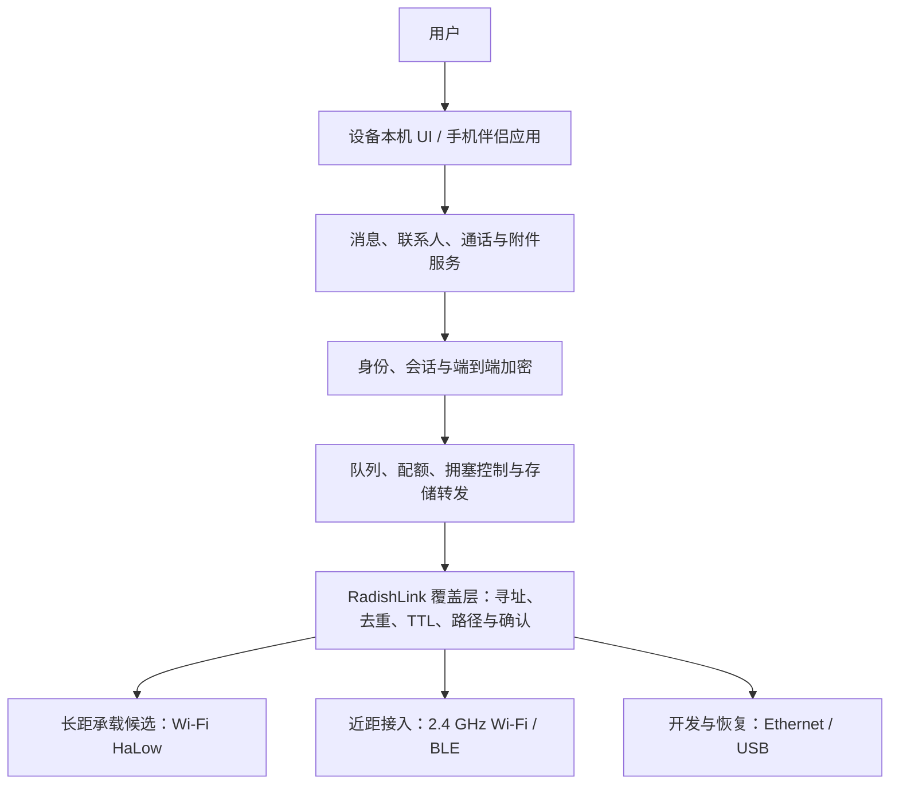

# RadishLink 系统架构

## 目的

本文定义从随身设备、手机到无线承载的稳定分层。它不冻结具体 SoC、UI 框架或密码实现库。

## 总体结构

核心约束是上层只依赖“可发送数据报或流的邻接链路”，不能知道底层一定是 MM8108、802.11s 或某个监管域。这样才能在 HaLow 尚未通过法规和性能验证时继续开发协议，也能在未来增加其他合法长距承载。

## 单节点组成

### 应用处理器

嵌入式 Linux 负责：

- 邻居、路由和存储转发；
- 密钥协议、加密存储和设备管理；
- 图片缩放、Opus、视频编解码和媒体会话；
- 本机 UI、手机 API、日志和签名升级；
- HaLow、2.4 GHz Wi-Fi、BLE、USB 与音视频外设驱动。

POC 可使用 Raspberry Pi 4 级平台。工程样机必须换成具备硬件视频编解码、长期供货和可控启动链的嵌入式 SoM/SoC。

### 长距无线

Wi-Fi HaLow 是首选候选，理由是它提供 IP 友好的 Wi-Fi 语义、较窄信道、Sub-1 GHz 传播和比 LoRa 更高的媒体吞吐潜力。无线模块只负责邻接承载和逐跳保护，不拥有用户身份或内容密钥。

### 近距无线

独立 2.4 GHz Wi-Fi / BLE 用于：

- 手机和 Mac 的本地接入；
- 首次配对、二维码确认和设备设置；
- 无线调试与升级；
- HaLow 不可用时的近距离节点直连候选。

长距和近距射频应尽量使用独立芯片、天线与并发能力，避免手机接入占用 HaLow 回传信道。

### 可选低功耗 MCU

ESP32-S3 可负责电源键、充电状态、按键扫描、低功耗唤醒、简单显示或主处理器看门狗。它支持 2.4 GHz Wi-Fi、BLE 和 OTA，但不具备 HaLow 射频，也不适合作为完整视频、Linux 网络栈和多跳媒体主控。

ESP32-S3 的首次写入仍需 USB/UART/JTAG、预烧录或生产治具。建立可信固件后，后续版本可以通过本地 Wi-Fi/BLE 或主处理器转交签名镜像实现 OTA，并保留回滚槽。

### 安全器件

工程样机评估独立安全元件或 SoC 可信存储，用于设备身份私钥、启动信任根和防回滚计数。安全元件型号随最终算法、供应和制造流程选择，不在 POC 早期冻结。

## 数据路径

### 文字与附件

1. 发送端生成不可重复的消息 ID，执行内容限额与端到端加密。
2. 覆盖层选择下一跳；没有实时路径时进入有上限的持久队列。
3. 中继只读取目标提示、过期时间、优先级、大小和防环所需字段。
4. 接收端验证身份、重放窗口和内容完整性，解密后回传端到端确认。
5. 中继在过期、确认或配额回收后删除密文副本。

### 实时媒体

1. 信令通过加密消息通道协商身份、编解码器、码率和候选路径。
2. 路径满足准入条件后建立低时延媒体流；中继只转发加密帧。
3. 拥塞时按视频增强层、视频、附件、语音、文字/控制的顺序降级。
4. 路径不可维持时，视频自动降为语音；语音不可维持时结束实时会话并保留留言入口。

## 部署形态

- **纯设备**：用户直接在 RadishLink Node 上操作，完整功能不依赖手机。
- **设备 + 手机**：手机连接最近节点，承担键盘、相机、屏幕和耳机；节点继续承担 HaLow 和中继。
- **固定中继增强**：同一种协议设备可接持续电源并启用更积极的中继策略，但网络不要求它永久在线。
- **开发台架**：Mac 通过 2.4 GHz Wi-Fi、Ethernet 或 SSH 访问节点；USB 只作为首次恢复和底层调试兜底。

## 故障边界

- 近距无线故障不应停止设备本机通信；
- 手机应用退出不应使 HaLow 路由消失；
- 中继重启不能使发送端永久认为消息已送达；
- 时间不准确时仍要防止明显重放，不能只依赖墙上时钟；
- 存储接近上限时先淘汰过期低优先级附件，不能挤掉身份状态和控制消息；
- 升级失败必须回滚到已验证镜像，不能依赖互联网恢复。
