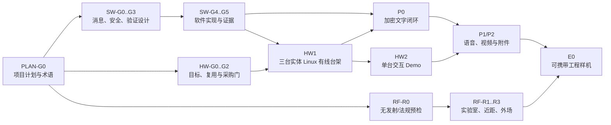

# RadishLink 项目执行计划

- 状态：Accepted（`PLAN-G0`，2026-08-24）；2026-09-05 的近期工作包与修订候选不改变该接受范围
- 更新日期：2026-09-05
- 适用范围：D0 至 E0 的产品成熟度、软件、硬件与射频证据依赖
- 目标读者：产品、架构、安全、软件、硬件、法规与测试协作者

## 目的

本文是项目级执行入口，用来回答“当前在哪个阶段、下一步先设计什么、什么证据允许进入下一阶段”。它不取代产品定义、专题设计、ADR 或测试规范，而是约束它们的顺序和依赖。

项目不再用一个编号同时表示产品阶段、软件实验、硬件样机和射频测试。所有成果必须同时标明产品成熟度和证据轨，避免把局部探针写成项目完成。

## PLAN-G0 评审记录

- 结论：Accepted；
- 日期：2026-08-24；
- 接受范围：`D0/P0/P1/P2/E0` 产品成熟度、`SW/HW/RF/EXP` 证据轨、总体依赖、阶段进入关系和计划停止线；
- 直接结果：允许分别进入 `SW-G1..G3`、`HW-G0/HW-G1` 和 `RF-R0` 的设计或只读核对；
- 授权边界：本 gate 不授权实现、依赖安装、容器或虚拟机运行、采购、刷写、设备启动、射频发射或远程状态修改。

## 命名体系

### 产品成熟度

产品成熟度保持现有顺序：

- `D0`：定义、法规预检与方案设计；
- `P0`：加密文字三节点闭环；
- `P1`：实时语音与链路自适应；
- `P2`：受限视频与附件；
- `E0`：可携带工程样机。

只有[路线图](../roadmap.md)的进入与退出条件全部满足，产品成熟度才推进。

### 证据轨

- `SW-*`：消息语义、E2EE、持久化、故障注入和软件模拟；
- `HW-*`：实体 Linux 节点、交互/电源辅助 MCU、接口、启动、存储、资源与物理恢复；
- `RF-*`：地区法规、SKU、监管域、射频台架、距离和携带状态；
- `EXP-*`：在计划前或阶段外执行的探索性探针，只能作为需求输入。

示例：2026-08-20 的 Docker 运行记为 `SW-EXP-001`，不称为 `E0`、`P0 PASS` 或已完成 `SW-V0`。

## 当前项目位置

产品仍处于 D0；软件计划、消息语义、确定性验证设计与 `SW-V0` 已有相应接受/运行记录，E2EE 决策、实体台架和无线地区前提仍未关闭。各候选及许可证的最新状态统一见[当前状态](current.md)，本计划不复制 run/hash 流水。

截至 2026-09-05，mls-rs D2 已通过固定图 Phase A，R1c-R 与 R1d-L 分别形成许可证证据与处置 `STOP`，debug_tree 澄清 helper 已离线实施，R2 与 Phase B 仍被阻断；不能继续使用“R1 尚未执行”的旧状态。

## 总体依赖

该图只表达进入关系，不表示工作必须完全串行。法规预检、候选硬件资料和软件设计可以并行；实现、采购和发射分别受各自授权门约束。

## 阶段路线

### D0：先完成设计门

必须形成：

- `PLAN-G0`：接受本执行计划的阶段、证据轨和停止线；
- `SW-G0..G3`：软件计划、消息交付语义、E2EE/身份候选和验证设计；
- `HW-G0`：硬件验证目标、非目标和分层路线；
- `RF-R0`：首个目标地区、候选 SKU、频段、功率、带宽和天线问题清单；
- 采购、依赖、系统配置和外部运行的授权边界。

D0 可以包含只读盘点、候选比较和探索性证据，但不把它们写成 P0 能力。

### P0：文字、安全与三节点实体闭环

建议证据组合：

- `SW-G4..G5`：经评审的软件实现与确定性故障矩阵；
- `HW1`：三台独立 Linux 节点的有线、无射频物理台架；
- E2EE/身份 ADR、跨重启状态安全和 B 不可解密负例；
- `HW2`：一台具备按键、显示和电源状态的交互 Demo，另外两台可以 headless；
- Mac/手机本地 Web 路径与设备本机最小操作路径。

P0 不要求 HaLow 距离通过，但正式退出仍要求应用层安全和三节点语义真实成立。

### P1：实时语音与资源预算

- 在 `SW/HW` 台架上先验证 Opus、优先队列、抖动缓冲和路径降级；
- `HW2` 增加实际音频 I/O、十分钟稳定性和粗粒度 CPU/内存/功耗记录；
- 只有 `RF-R1/R2` 合法通过后，才把真实无线链路数据加入语音结论。

### P2：视频、附件与集成压力

- 验证硬件编码、附件断点、文字优先和视频降级；
- 开始比较 2GB 以上 Linux SBC/SoM 的编解码、接口、热和存储；
- 不因低成本 Demo 能显示视频就冻结量产 SoC 或承诺距离。

### E0：产品形态与射频合流

- 基于 P0–P2 证据选择应用处理器、HaLow、近距无线、辅助 MCU、显示、音频、电池和升级链；
- 完成三至十节点、携带状态、功耗、热、恢复和相应 `RF-R*` 测试；
- 自定义 PCB、整机天线和认证路线只在该阶段进入，不由开发板 Demo 提前替代。

## 近期工作包与决策顺序

2026-09-05 的文档完善将近期准备集中到下表。表中角色是决策职责，不表示已指派外部人员；所有者在启动相应工作包时确认执行者、投入上限和复核日期。日期未定时明确保持待定；到期缺输入应选择补证、调整范围或暂停，不无限延长取证。

| 优先级 | 工作包与真相源 | 可审阅产物 / 关闭标准 | 决策责任与边界 |
| --- | --- | --- | --- |
| 最高 | [首个用户场景](../product-definition.md)、[地区预检](../regulatory/radio-compliance.md) | 明确用户、三项核心操作、手机缺席路径、测试/使用地区、预算范围；地区无可行路径时形成调整或暂停选择 | 所有者定产品范围，专业方核对法规；不采购、不发射 |
| 最高 | [阶段顺序修订候选](../roadmap.md#阶段顺序修订候选待评审) | 对比视频是否阻挡可携带文字/语音样机，并列出对产品、HW/RF 和退出条件的影响 | 所有者接受后重开相应计划决策；目前 `PLAN-G0` 基线不变 |
| 高 | [E2EE 决策包](../security/e2ee-sw-g2-decision-package.md)及现有 R1d 处置 | 按实际渠道形成许可证评审输入；分别处理 debug_tree 与 r-efi，满足新证据轨/R2 条件 | 专业许可证意见、工程证据复核和所有者决策分开；不放宽现行 gate，不进入 Phase B |
| 高 | [手机身份](../mobile/companion-app.md)、[路由边界](../architecture/network-and-routing.md)与安全状态 | 明确端点、密钥/历史归属、物理与覆盖层 hop 映射、事务和 relay-clear proof 可实现性 | 系统/安全评审；不由 UI 或具体库默认值代替决策 |
| 高 | [软件计划](d0-t0-p0-plan.md)与 [SW-G3 勘误](../testing/sw-g3-deterministic-validation-design.md#2026-09-05-实现前勘误待评审) | 最小文字纵向切片及重试、长度、观测边界；明确 profile 版本和实现清单 | SW-G3 原值保留，修订接受后另行实施；V1/V2 合成验证不能代替 V3 |
| 中 | [HW0 盘点](../hardware/hardware-validation-plan.md)与[联合预算](../hardware/hardware-strategy.md#能量体积与成本联合预算) | 复用设备清单、接口拓扑、典型日负载、Wh/重量/体积/整套成本和测量方法 | 所有者指定现有设备；先评审 HW-G0/G1，不启动或覆盖设备 |
| 中 | [已有工具验证与 CI](../governance/repository-governance.md#已有工具的质量入口演进) | 将现有离线测试纳入拟实施清单，识别重复 runner/monitor/finalizer 的稳定职责 | 另案代码/CI 实施；本轮只有文档，无已生效的新 job |

审计与上游补证等待期间，可以继续已授权的范围设计、接口评审和只读资料整理。没有相应实现/运行授权时，不把“可以并行”解释为允许启动实验。项目进展按关闭的不确定性和验证的用户路径判断，不按 helper、提交或 gate 数量判断。

## 计划与授权门

- `PLAN-G0` 未通过：只修订文档和做只读资料核对；
- `SW-G4/SW-V0` 已完成但无持续授权：不扩展或重跑软件场景；
- `HW-G2` 未通过：不采购 SBC、MCU、外设或制作 PCB；
- `RF-R1` 未通过：不启动 HaLow 设备和任何射频发射；
- 密码 ADR 未通过：不安装或集成密码候选库，不宣称 E2EE；
- 每次外部运行仍需说明精确命令、设备、网络、时长、副作用和清理，计划本身不构成执行授权。

## 项目级复核节奏

每个 gate 只回答一个层级的问题：

1. 先审范围、术语和依赖；
2. 再审专题设计和失败模式；
3. 再审实现清单、BOM 或实验配置；
4. 最后执行、保存证据并判断是否通过。

任何测试结果暴露需求错误时，回到相应专题修订，不通过增加 fallback、降低门槛或扩大结论让既有实现“继续通过”。
