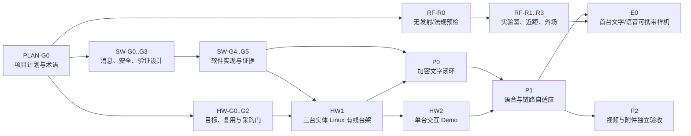

# RadishLink 项目执行计划

- 状态：Accepted（`PLAN-G0`，2026-08-24）；2026-09-26 确认视频顺序，2026-10-09 细化场景、预算、端点职责与评审方向；专题安全/验证设计仍待评审
- 更新日期：2026-10-09
- 适用范围：D0 至 E0 的产品成熟度、软件、硬件与射频证据依赖
- 目标读者：产品、架构、安全、软件、硬件、法规与测试协作者

## 目的

本文是项目级执行入口，用来回答“当前在哪个阶段、下一步先设计什么、什么证据允许进入下一阶段”。它不取代产品定义、专题设计、ADR 或测试规范，而是约束它们的顺序和依赖。

项目不再用一个编号同时表示产品阶段、软件实验、硬件样机和射频测试。所有成果必须同时标明产品成熟度和证据轨，避免把局部探针写成项目完成。

## PLAN-G0 评审记录

- 结论：Accepted；
- 日期：2026-08-24；
- 接受范围：`D0/P0/P1/P2/E0` 产品成熟度、`SW/HW/RF/EXP` 证据轨、总体依赖、阶段进入关系和计划停止线；
- 直接结果：允许分别进入 `SW-G1..G3`、`HW-G0/HW-G1` 和 `RF-R0` 的设计或只读核对；
- 授权边界：本 gate 不授权实现、依赖安装、容器或虚拟机运行、采购、刷写、设备启动、射频发射或远程状态修改。

## 命名体系

### 产品成熟度

产品成熟度保留以下编号；2026-09-26 起 P2 不再是首台 E0 文字/语音样机的顺序前置：

- `D0`：定义、法规预检与方案设计；
- `P0`：加密文字三节点闭环；
- `P1`：实时语音与链路自适应；
- `P2`：受限视频与附件；
- `E0`：可携带工程样机。

只有[路线图](../roadmap.md)的进入与退出条件全部满足，产品成熟度才推进。

### 证据轨

- `SW-*`：消息语义、E2EE、持久化、故障注入和软件模拟；
- `HW-*`：实体 Linux 节点、交互/电源辅助 MCU、接口、启动、存储、资源与物理恢复；
- `RF-*`：地区法规、SKU、监管域、射频台架、距离和携带状态；
- `EXP-*`：在计划前或阶段外执行的探索性探针，只能作为需求输入。

示例：2026-08-20 的 Docker 运行记为 `SW-EXP-001`，不称为 `E0`、`P0 PASS` 或已完成 `SW-V0`。

## 当前项目位置

产品仍处于 D0；软件计划、消息语义、确定性验证设计与 `SW-V0` 已有相应接受/运行记录，E2EE 决策、实体台架和无线地区前提仍未关闭。各候选及许可证的最新状态统一见[当前状态](current.md)，本计划不复制 run/hash 流水。

截至 2026-09-05，mls-rs D2 已通过固定图 Phase A，R1c-R 与 R1d-L 分别形成许可证证据与处置 `STOP`，debug_tree 澄清 helper 已离线实施，R2 与 Phase B 仍被阻断；不能继续使用“R1 尚未执行”的旧状态。

### 2026-09-26 范围决定与本轮产物

所有者确认熟人小队预先配对的首期场景、中国上海测试/使用地区、整套人民币 2000 元预算，以及视频不阻挡首台文字/语音样机。具体输入见[产品定义](../product-definition.md#首期范围决定2026-09-26)，阶段影响见[路线图](../roadmap.md#阶段顺序修订记录2026-09-26)。本次只调整已说明的产品范围和阶段依赖，不接受尚未评审的 SW-G2/SW-G3 修订，不授权采购或外部运行。

本轮形成[SW-G3 修订评审包](../testing/sw-g3-revision-2-review.md)和[最小文字闭环设计](../architecture/minimal-text-slice.md)，均为 Draft；许可证按渠道的具体待填输入收敛到[SW-G2 评审输入](../security/e2ee-sw-g2-decision-package.md#2026-09-26-许可证评审输入与责任)。当前阶段仍为 D0。

### 2026-10-09 接续决定

所有者将整套预算调整为目标 2000–3000 元、累计硬上限 3000 元，并接受 3–5 人熟人小队、白天 6–8 小时活动与背包携带目标。上海地区不变，场地按验证需要选择。首期 Node 持有身份、会话与历史，手机为已授权界面；硬件先复用/借用三台 Linux 有线台架，再做单台交互，同日所有者确认没有可复用设备，当前优先评估 Radxa ZERO 3E 2GB 全新增方案，首轮有线台架新增支出评审上限仍为 1000 元。

许可证按实际产物分阶段评审，先限定所有者控制的 Linux ARM64 合成实验、暂不向他人交付镜像/安装包；近期优先固定 mls-rs 0.56.0，分别推进 debug_tree 固定源码澄清与 r-efi MIT alternative 独立评审。详见[当前产品输入](../product-definition.md#当前范围细化2026-10-09)、[硬件盘点](../hardware/poc-purchase-list.md#hw0-设备盘点与增量成本输入)和[许可证/安全输入](../security/e2ee-sw-g2-decision-package.md#2026-10-09-所有者选择与近期评审输入)。

此次确认产品方向及后续评审范围，不接受全部 SW-G2/SW-G3 或详细 HW-G0/G1，不改变现行 gate/allowlist/lockfile、原 I5 合同和 768 MiB 上限，不授权采购、设备启动、依赖安装、公开发送或正式实验。没有新实测，产品仍在 D0。

## 总体依赖

```mermaid
flowchart LR
    plan["PLAN-G0<br/>项目计划与术语"]
    swd["SW-G0..G3<br/>消息、安全、验证设计"]
    swv["SW-G4..G5<br/>软件实现与证据"]
    hwd["HW-G0..G2<br/>目标、复用与采购门"]
    hw1["HW1<br/>三台实体 Linux 有线台架"]
    hw2["HW2<br/>单台交互 Demo"]
    rf0["RF-R0<br/>无发射/法规预检"]
    rf1["RF-R1..R3<br/>实验室、近距、外场"]
    p0["P0<br/>加密文字闭环"]
    p1["P1<br/>语音与链路自适应"]
    p2["P2<br/>视频与附件独立验收"]
    e0["E0<br/>首台文字/语音可携带样机"]

    plan --> swd --> swv
    plan --> hwd
    swv --> hw1 --> hw2
    hwd --> hw1
    plan --> rf0 --> rf1
    swv --> p0
    hw1 --> p0
    p0 --> p1 --> e0
    p1 --> p2
    hw2 --> p1
    rf1 --> e0
```

该图只表达进入关系，不表示工作必须完全串行。法规预检、候选硬件资料和软件设计可以并行；实现、采购和发射分别受各自授权门约束。

## 阶段路线

### D0：先完成设计门

必须形成：

- `PLAN-G0`：接受本执行计划的阶段、证据轨和停止线；
- `SW-G0..G3`：软件计划、消息交付语义、E2EE/身份候选和验证设计；
- `HW-G0`：硬件验证目标、非目标和分层路线；
- `RF-R0`：首个目标地区、候选 SKU、频段、功率、带宽和天线问题清单；
- 采购、依赖、系统配置和外部运行的授权边界。

D0 可以包含只读盘点、候选比较和探索性证据，但不把它们写成 P0 能力。

### P0：文字、安全与三节点实体闭环

建议证据组合：

- `SW-G4..G5`：经评审的软件实现与确定性故障矩阵；
- `HW1`：三台独立 Linux 节点的有线、无射频物理台架；
- E2EE/身份 ADR、跨重启状态安全和 B 不可解密负例；
- `HW2`：一台具备按键、显示和电源状态的交互 Demo，另外两台可以 headless；
- Mac/手机本地 Web 路径与设备本机最小操作路径。

P0 不要求 HaLow 距离通过，但正式退出仍要求应用层安全和三节点语义真实成立。

### P1：实时语音与资源预算

- 在 `SW/HW` 台架上先验证 Opus、优先队列、抖动缓冲和路径降级；
- `HW2` 增加实际音频 I/O、十分钟稳定性和粗粒度 CPU/内存/功耗记录；
- 只有 `RF-R1/R2` 合法通过后，才把真实无线链路数据加入语音结论。

### P2：视频、附件与集成压力

- 验证硬件编码、附件断点、文字优先和视频降级；
- 开始比较 2GB 以上 Linux SBC/SoM 的编解码、接口、热和存储；
- 不因低成本 Demo 能显示视频就冻结量产 SoC 或承诺距离。

### E0：产品形态与射频合流

- 首台基于 P0/P1 及相应 HW/RF 证据选择应用处理器、经地区核对的长距无线、近距无线、辅助 MCU、显示、音频、电池和升级链；P2 及视频硬件在后续视频样机单独评审；
- 完成三至十节点、携带状态、功耗、热、恢复和相应 `RF-R*` 测试；
- 自定义 PCB、整机天线和认证路线只在该阶段进入，不由开发板 Demo 提前替代。

## 近期工作包与决策顺序

下表于 2026-10-09 按接续决定更新。表中角色是决策职责，不表示已指派外部人员；所有者在启动相应工作包时确认执行者、投入上限和复核日期。日期未定时明确保持待定；到期缺输入应选择补证、调整范围或暂停，不无限延长取证。

| 优先级 | 工作包与真相源 | 可审阅产物 / 关闭标准 | 决策责任与边界 |
| --- | --- | --- | --- |
| 最高 | [首个用户场景](../product-definition.md)、[地区预检](../regulatory/radio-compliance.md) | 3–5 人、6–8 小时活动、背包携带、上海与整套最高 3000 元已确认；补齐操作频率、断连时长、数值携带上限及具体 SKU/配置书面路径 | 所有者补实际输入，专业方核对法规；场地可选不等于 RF 通过 |
| 已确认范围 | [阶段顺序修订记录](../roadmap.md#阶段顺序修订记录2026-09-26) | 首台 E0 文字/语音样机不等待 P2；产品、依赖图、硬件与媒体验收同步 | 所有者已选择；安全、升级恢复、HW/RF 门不变，阶段未通过 |
| 高 | [E2EE 决策包](../security/e2ee-sw-g2-decision-package.md)及现有 R1d 处置 | 优先固定 mls-rs 0.56.0；先按内部 Linux ARM64 合成实验补齐精确产物输入，分别处理 debug_tree 与 r-efi，满足新证据轨/R2 条件 | 分渠道方向已接受，专业意见与新合同仍待完成；不放宽现行 gate，不进入 Phase B |
| 高 | [手机身份](../mobile/companion-app.md)、[路由边界](../architecture/network-and-routing.md)与安全状态 | Node 身份/会话/历史及手机界面职责已选择；继续证明首次信任、撤销、hop 映射、事务和 relay-clear proof | 系统/安全评审；方向接受不等于密码实现或 SW-G2 通过 |
| 高 | [文字闭环设计](../architecture/minimal-text-slice.md)、[SW-G3 修订包](../testing/sw-g3-revision-2-review.md)与 [I5 三进程闭环包](../testing/sw-g4-synthetic-i5-plan.md) | I1–I5-I 已提交并通过各自离线验证；[资源隔离设计](../testing/sw-g4-synthetic-i5-resource-isolation.md)保留整批 768 MiB，证据计费、容量探测及受限双构建 helper 离线通过，后续完成运行接入、daemon 隔离及环境验收再重新开放入口 | 当前 preflight/run 停止；测试文件存储不替代生产数据库/安全联合提交，不宣称正式 V1/V2/V3 通过 |
| 中 | [HW0 盘点](../hardware/poc-purchase-list.md#hw0-设备盘点与增量成本输入)与[联合预算](../hardware/hardware-strategy.md#能量体积与成本联合预算) | 核算无可复用设备条件下 Radxa ZERO 3E 2GB 三节点全新增候选 BOM；首轮新增评审上限 1000 元，累计最高 3000 元；核算 Wh/重量/体积 | 无可复用设备已确认，候选/BSP 与报价待核对；详细 HW-G0/G1 待评审，不启动或覆盖设备 |
| 中 | [已有工具验证与 CI](../governance/repository-governance.md#已有工具的质量入口演进) | 将现有离线测试纳入拟实施清单，识别重复 runner/monitor/finalizer 的稳定职责 | 另案代码/CI 实施；I1 本轮未修改 CI，无已生效的新 job |

审计与上游补证等待期间，可以继续已授权的范围设计、接口评审和只读资料整理。没有相应实现/运行授权时，不把“可以并行”解释为允许启动实验。项目进展按关闭的不确定性和验证的用户路径判断，不按 helper、提交或 gate 数量判断。

I1–I5-I 已接受有限范围、完成离线验证并提交；[I5 三进程文字闭环包](../testing/sw-g4-synthetic-i5-plan.md)保留 I5-R 三容器 21 样本运行、资源上限、停止及精确清理条件。整批 768 MiB 不变；[资源隔离设计](../testing/sw-g4-synthetic-i5-resource-isolation.md)中的入口停止、证据计费、容量探测和受限双构建 helper 已提交并完成各自离线验证，运行接入及 daemon/store 隔离仍未完成。

专用 UTM 的历史准备及 10 月 6 日有效盘点见资源专题。2026-10-09 [完整补充盘点与正常回收](../testing/sw-g4-synthetic-i5-environment-preparation.md#完整补充盘点与正常回收通过2026-10-09)已通过，诊断与限额调整提交为 `3aab466`：已取得完整包表、APT/dpkg/gpgv/sqv 路径归属、swap/挂载和服务状态，VM 正常停止。现有验签器不等于来源签名通过；Docker/Go 等工具仍未安装，构建/克隆身份和四个容量域未准备，系统盘/swap/宿主写入没有完整硬边界。七个 VM 相关单次包及一次宿主观察均已消费，不能重用。下一步按[2026-10-10 事项](2026-10-09-progress.md#明日事项2026-10-10)收敛可信输入、安装差量和完整额度方案，环境操作及真实验收另行精确授权；通过后才重新开放预检并固定 I5-R 运行提交/产物。21 样本矩阵尚未执行，旧 V0 授权不扩大。

整体文字切片仍有安全缺口。2026-10-09 所有者已确认无可复用设备，硬件转入全新增 BOM 核算；许可证、上海法规工作的责任人与复核日期仍待指定，不启动自动监控或擅自联系第三方。地区无可行路径或预算不足时，提交明确取舍再决定后续承载与硬件工作。

## 计划与授权门

- `PLAN-G0` 未通过：只修订文档和做只读资料核对；
- `SW-G4/SW-V0` 已完成但无持续授权：不扩展或重跑软件场景；
- `HW-G2` 未通过：不采购 SBC、MCU、外设或制作 PCB；
- `RF-R1` 未通过：不启动 HaLow 设备和任何射频发射；
- 密码 ADR 未通过：不安装或集成密码候选库，不宣称 E2EE；
- 每次外部运行仍需说明精确命令、设备、网络、时长、副作用和清理，计划本身不构成执行授权。

## 项目级复核节奏

每个 gate 只回答一个层级的问题：

1. 先审范围、术语和依赖；
2. 再审专题设计和失败模式；
3. 再审实现清单、BOM 或实验配置；
4. 最后执行、保存证据并判断是否通过。

任何测试结果暴露需求错误时，回到相应专题修订，不通过增加 fallback、降低门槛或扩大结论让既有实现“继续通过”。
